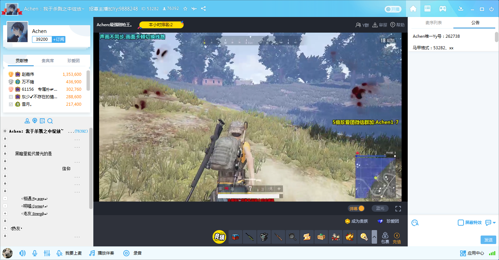

title: 廖国光的职级面试
speaker: 廖国光
url: https://github.com/movins/readme
js:
    - https://www.echartsjs.com/asset/theme/infographic.js
plugins:
    - echarts: {theme: infographic}
    - mermaid: {theme: forest}
    - katex

<slide class="bg-black aligncenter" image="https://source.unsplash.com/n9WPPWiPPJw/ .anim">

# 职级面试 {.text-landing.text-shadow}

廖国光 {.text-intro.animated.fadeInUp.delay-500}

<slide :class="size-60 aligncenter">

### 一、个人简介

---

`07年毕业于湖南大学，之前任职于酷狗等公司，13年进入YY，至今...` {.animated.fadeInUp}

<slide :class="aligncenter">

### 二、参与的项目

---

:::gallery


## 交友模板 (2013--2018)

C++、Flash、H5

---



## 游戏直播模板 (2018--2019)

H5

---


## 基于Vue的控件库 (2018)
H5

:::

<slide>

:::steps

### 交友模板

---

C++版本

:::

:::column

:::flexblock {.specs}

::fa-life-ring::

### 预期：初期稳定版本

从零开始研发，经过多次版本的深层次重构，得到一个稳定的初期版本。

---

::fa-battery-full::

### 角色：主要开发人员（共2人）

基于QT使用C++开发，负责项目UI部分。

---

::fa-info-circle::

### 难点：稳定性、复杂动画

大活动中切模板时的稳定性，产品和美术复杂的动画需求。

:::

:::

<slide>

:::steps

### 交友模板

---

C++版本

---

Flash版本

:::

:::column

:::flexblock {.specs}

::fa-life-ring::

### 预期：跨平台、炫酷效果、异步加载、高开发效率

随着项目快速发展，项目不局限于PC频道运行，还需要在Web浏览器运行，越来越炫酷的动画特效让C++实现越来越吃力，随着模块越来越多，开发效率及加载速度也是急需面对的问题。

---

::fa-battery-full::

### 角色：项目负责人（共2人）

基于MINISDK、PC开放平台、MORNUI使用AS3语言开发，接口调用使用桥接方式，模块封装使用了MVC模式和事件中心机制，界面和数据逻辑完全分离并异步加载。负责框架的构建、所有模块数据接入处理、部分UI开发及发布部署。

---

::fa-info-circle::

### 难点：跨平台、异步加载、大视频

项目根据运行环境选择调用MINISDK、PC开放平台、DLL框架、Web框架接口；逻辑与界面、模块与模块异步加载和容错；大视频性能问题（由于开放平台问题至今无法解决）。

:::

:::

<slide>

:::steps

### 交友模板

---

C++版本

---

Flash版本

---

H5版本

:::

:::column

:::flexblock {.specs}

::fa-life-ring::

### 预期：替换Flash版本

Flash插件更新快及不稳定，带来了不可预期的风险，为预防风险，寻找技术替代方案。

---

::fa-battery-full::

### 角色：项目负责人（共2人）

基于CEF、layabox、svga、H5媒体SDK使用javascript开发。负责框架的构建、调用接口封装、所有模块数据接入处理、部分UI的开发及发布部署。遗憾的是，历时4个多月，完成了第一个可测试版本(90%)，之后由于某些原因未能继续。

---

::fa-info-circle::

### 难点：跨平台、异步加载、大视频

项目根据运行环境选择调用H5媒体SDK、CEF、DLL框架、Web框架接口；逻辑与界面、模块与模块异步加载和容错；大视频性能问题。

:::

:::

<slide>

:::steps

### 游戏直播模板

---

H5版本

:::

:::column

:::flexblock {.specs}

::fa-life-ring::

### 预期：H5重构版本

面对Flash插件已停止维护、主流浏览器对Flash插件不推荐、大视频性能瓶颈等问题，急需验证H5作为替代Flash模板开发的可行性。

---

::fa-battery-full::

### 角色：项目负责人（共1人）

基于CEF、vue开发，完整实现了游戏直播模板功能并按时上线。

---

::fa-info-circle::

### 难点：1080p 60帧大视频

使用webgl直接在Canvas绘制yuv格式视频帧，1080p 60帧视频性能接近C++模板。

:::

:::

<slide>

:::steps

### 基于Vue的控件库

:::

:::column

:::flexblock {.specs}

::fa-life-ring::

### 预期：通用Vue控件库

在H5开发过程中，增加代码的可复用性，节省时间成本，非常必要。眼下很多热门基于Vue的控件库(elementui、iview等)，图片纹理背景，大小变化都支持不好，在PC模板开发中的使用受局限。

---

::fa-battery-full::

### 角色：项目负责人（共1人）

基于Vue开发，已完成基本控件(u-button、u-svga等)的开发，并已应用于游戏直播模板H5重构，接下来将用于轻语PC端。

---

::fa-info-circle::

### 难点：图片纹理切片及九宫图

先检查切片信息考虑对图片素材是否切片，再检查九宫图信息考虑对切片是否拉升, 获取到纹理base64信息，并存入cache中。

:::

:::

<slide>
### yui--example

---


```html
    import btnImg from './img/barragefullscreen_btn.png';
    ...
    <u-button icon="logo-github" width="500px" height="37px" :skin="btnImg" rule="3,1,1||12,16,12,19" color="red|blue|black">有背景</u-button>
    <u-button icon="logo-github" width="500px" height="37px" :skin="btnImg" rule="3,1,1||12,16,12,19" selected color="red|blue|black">默认选中态</u-button>
    <u-button width="26px" height="37px" :skin="btnImg" rule="3,1,1"></u-button>
```

<slide class="fullscreen">

:::card


---

## 轻语PC客户端

轻语PC客户端为独立运行exe，基于Cef + H5，界面使用yui

...

:::

<slide class="bg-black aligncenter" image="https://source.unsplash.com/n9WPPWiPPJw/ .anim">

## 谢谢大家 {.animated.tada}