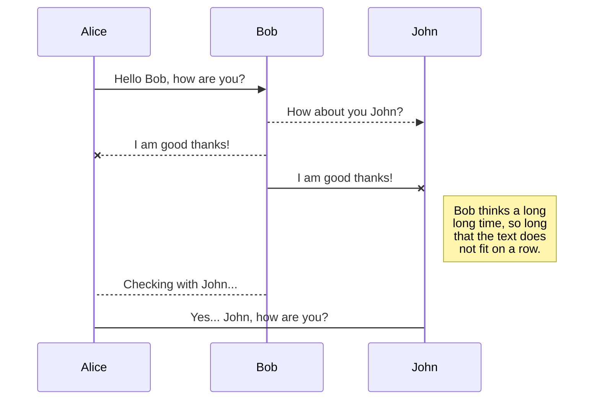
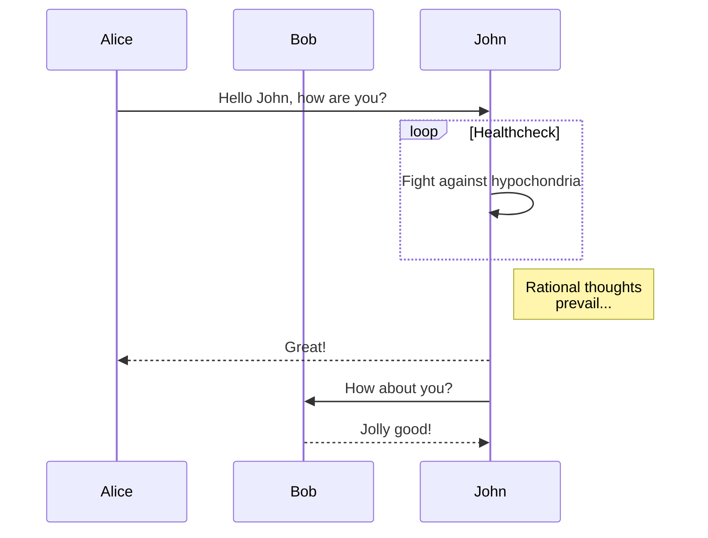
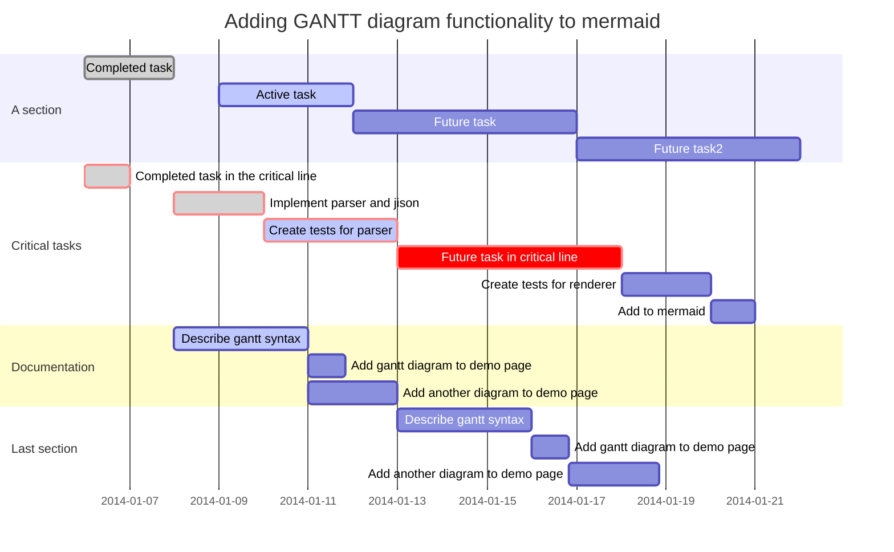
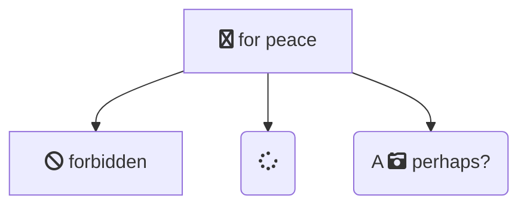

title: 廖国光的职级面试
speaker: 廖国光
url: https://github.com/movins/readme
js:
    - https://www.echartsjs.com/asset/theme/infographic.js
plugins:
    - echarts: {theme: infographic}
    - mermaid: {theme: forest}
    - katex

<slide class="bg-black-blue aligncenter" image="https://cn.bing.com/az/hprichbg/rb/RainierDawn_EN-AU3730494945_1920x1080.jpg .dark">

# 职级面试 {.text-landing.text-shadow}

廖国光 {.text-intro.animated.fadeInUp.delay-500}

<slide :class="size-60 aligncenter">

### 一、个人简介

---

`07年毕业于湖南大学，之前任职于酷狗等公司，13年进入YY，至今...` {.animated.fadeInUp}

<slide :class="aligncenter">

### 二、参与的项目

---

:::gallery


## 交友模板

C++、Flash、H5

---


## 游戏直播模板

H5

---


## 基于Vue的控件库
H5

:::

<slide>

:::steps

### 交友模板

---

C++版本

:::

:::column

:::flexblock {.specs}

::fa-life-ring::

### 预期：初期稳定版本

从零开始研发，经过多次版本的深层次重构，得到一个稳定的初期版本。

---

::fa-battery-full::

### 角色：主要开发人员（共2人）

基于QT使用C++开发，负责项目UI部分。

---

::fa-info-circle::

### 难点：稳定性、复杂动画

大活动中切模板时的稳定性，产品和美术复杂的动画需求。

:::

:::

<slide>

:::steps

### 交友模板

---

C++版本

---

Flash版本

:::

:::column

:::flexblock {.specs}

::fa-life-ring::

### 预期：跨平台、炫酷效果、异步加载、高开发效率

随着项目快速发展，项目不局限于PC频道运行，还需要在Web浏览器运行，越来越炫酷的动画特效让C++实现越来越吃力，随着模块越来越多，开发效率及加载速度也是急需面对的问题。

---

::fa-battery-full::

### 角色：项目负责人（共2人）

基于MINISDK、PC开放平台、MORNUI使用AS3语言开发，接口调用使用桥接方式，模块封装使用了MVC模式和事件中心机制，界面和数据逻辑完全分离并异步加载。负责框架的构建、所有模块数据接入处理、部分UI开发及发布部署。

---

::fa-info-circle::

### 难点：跨平台、异步加载、大视频

项目根据运行环境选择调用MINISDK、PC开放平台、DLL框架、Web框架接口；逻辑与界面、模块与模块异步加载和容错；大视频性能问题（由于开放平台问题至今无法解决）。

:::

:::

<slide>

:::steps

### 交友模板

---

C++版本

---

Flash版本

---

H5版本

:::

:::column

:::flexblock {.specs}

::fa-life-ring::

### 预期：替换Flash版本

Flash插件更新快及不稳定，带来了不可预期的风险，为预防风险，寻找技术替代方案。

---

::fa-battery-full::

### 角色：项目负责人（共2人）

基于layabox、svga、H5媒体SDK使用javascript开发。负责框架的构建、调用接口封装、所有模块数据接入处理、部分UI的开发及发布部署。遗憾的是，历时4个多月，完成了第一个可测试版本(90%)，之后由于某些原因未能继续。

---

::fa-info-circle::

### 难点：跨平台、异步加载、大视频

项目根据运行环境选择调用H5媒体SDK、PC开放平台、DLL框架、Web框架接口；逻辑与界面、模块与模块异步加载和容错；大视频性能问题。

:::

:::

<slide>

:::steps

### 游戏直播模板

---

H5版本

:::

:::column

:::flexblock {.specs}

::fa-life-ring::

### 预期：H5重构版本

面对Flash插件已停止维护、主流浏览器对Flash插件不推荐、大视频性能瓶颈等问题，急需验证H5作为替代Flash模板开发的可行性。

---

::fa-battery-full::

### 角色：项目负责人（共1人）

基于CEF、vue开发，完整实现了游戏直播模板功能并按时上线。

---

::fa-info-circle::

### 难点：1080p 60帧大视频

使用webgl直接在Canvas绘制yuv格式视频帧，1080p 60帧视频性能接近C++模板。

:::

:::

<slide>

:::steps

### 基于Vue的控件库

:::

:::column

:::flexblock {.specs}

::fa-life-ring::

### 预期：通用Vue控件库

在H5开发过程中，增加代码的可复用性，节省时间成本，非常必要。眼下很多热门基于Vue的控件库(elementui、iview等)，图片纹理背景，大小变化都支持不好，在PC模板开发中的使用受局限。

---

::fa-battery-full::

### 角色：项目负责人（共1人）

基于Vue开发，已完成基本控件(u-button、u-svga等)的开发，并已应用于游戏直播模板H5重构。

---

::fa-info-circle::

### 难点：图片纹理切片及九宫图

先检查切片信息考虑对图片素材是否切片，再检查九宫图信息考虑对切片是否拉升, 获取到纹理base64信息，并存入cache中。

:::

:::

<slide class="bg-primary" :class="size-60 frame">

## View More? {.text-serif.aligncenter}

\* \* \* {.text-symbols}

<nav class="aligncenter">
* [:fa-github: 游戏直播H5](https://git.yy.com/webs/gameshow/gameshow-ui)
* [:fa-github: yui](https://git.yy.com/pc/ycube/yui)
* [:fa-tv: 交友flash](http://love.yy.com/#!/app/live?sid=87814665&ssid=87814665)
* [:fa-tv: 交友h5](http://love.yy.com/webIndex.html#!/app/live?sid=87814665&ssid=87814665)
{.no-list-style}

</nav>

<slide class="bg-black aligncenter" image="https://source.unsplash.com/n9WPPWiPPJw/ .anim">

## 谢谢大家 {.animated.tada}


<slide :class="size-50">

##  :fa-heart-o: CSS Syntax

WebSlides is so easy to understand and love. Baseline\: 8. {.text-intro}

* :Typography\::{.text-label}  .text-landing, .text-subtitle, .text-data, .text-intro...
* :BG Colors\::{.text-label}  .bg-primary, .bg-blue,.bg-apple...
* :BG Images\::{.text-label} .background, .background-center-bottom...
* :Sizes\::{.text-label} .size-50, .size-40...
* :Component\::{.text-label} card, flexblock, gallery...
* :Animation\::{.text-label} autoplay, animate.css...
{.description}

<slide :class="size-50 aligncenter">

## Text Classes

<slide class="aligncenter">
# Landings {.text-landing}

`.text-landing`

<slide class="aligncenter">
# Landings {.text-landing}

Create a simple web presence. {.text-intro}

`.text-intro`

<slide class="aligncenter">

POWERED BY [#WEBSLIDES](https://twitter.com/search?f=tweets&vertical=default&q=%23WebSlides&src=typd) `.text-subtitle` {.text-subtitle}

# Landings {.text-landing}

Create a simple web presence. {.text-intro}

`.text-intro`

<slide class="bg-black aligncenter" image="https://cn.bing.com/az/hprichbg/rb/RedAntarctica_EN-AU12197122155_1920x1080.jpg">
# **Landings** {.text-landing.text-shadow}

`.text-shadow` {.text-intro}

<slide class="bg-apple aligncenter">
## 4,235,678 {.text-data}

`.text-data`

<slide>

Why WebSlides? .text-context {.text-content}

## WebSlides is incredibly easy and versatile. The easiest way to make HTML presentations.

<slide>

`.text-cols (2 columns)`

:::div {.text-cols}

**Why WebSlides?** There are excellent presentation tools out there. WebSlides is about sharing content, essential features, and clean markup. **Each parent &lt;slide&gt;**  in the #webslides element is an individual slide.

**WebSlides help you build a culture of innovation and excellence**. When you're really passionate about your job, you can change the world. How to manage a design-driven organization? Leadership through usefulness, openness, empathy, and good taste.

:::

:::flexblock {.metrics}

:fa-phone:

Call us at 555.345.6789

----

:fa-twitter:

@username

----
:fa-envelope:
Send us an email
:::

<slide :class="size-50 aligncenter">

## Backgrounds

<slide>
## Corporate Backgrounds
:::flexblock {.blink.border}

## .bg-primary {..bg-primary}

\#44d

---

## .bg-secondary {..bg-secondary}

\#67d

---

## .bg-light {..bg-light}

\#edf2f7

---

## body

\#f7f9fb

:::

---

## General Colors

:::flexblock {.blink.border}

## .bg-black {..bg-black}

\#111

---

## .bg-black-blue {..bg-black-blue}

\#123

---

## .bg-white {..bg-white}

\#fff
:::

<slide>

## Colorful

:::flexblock {.border.blink}

## .bg-red {..bg-red}

\#c23

---

## .bg-green {..bg-green}

\#077

---

## .bg-blue {..bg-blue}

\#346

---

## .bg-purple {..bg-purple}

\#62b

:::

---

### Transparent Backgrounds

:::flexblock {.border.blink}

## .bg-trans-dark {..bg-trans-dark}

rgba(0, 0, 0, 0.5)

---

## .bg-trans-light {..bg-trans-light}

rgba(255, 255, 255, 0.2)

:::

<slide class="bg-gradient-h">
# Gradients

:::flexblock {.border}

Horizontal
`.bg-gradient-h`

---

Radial
`.bg-gradient-r`

---

Vertical
`.bg-gradient-v`
:::

<slide class="bg-gradient-v aligncenter">
## Vertical Gradient

`.bg-gradient-v`

<slide class="bg-gradient-r aligncenter">
## Radial Gradient

`.bg-gradient-r`

<slide class="bg-black" video="https://webslides.tv/static/videos/working.mp4 poster='https://webslides.tv/static/images/working.jpg'" >

`.background-video`

## **WebSlides is the easiest way to make HTML presentations. Inspire and engage.**

<slide class="bg-blue aligncenter" video="https://webslides.tv/static/videos/working.mp4 poster='https://webslides.tv/static/images/working.jpg' .dark">

## BG Video with Overlay {.text-landing}

`<slide class="bg-blue aligncenter" video="https://webslides.tv/static/videos/working.mp4 poster='https://webslides.tv/static/images/working.jpg' .dark">` or `.light`

<slide class="fullscreen bg-blue" youtube=".dark id='_m67JbGjWnc' autoplay loop" :class="aligncenter">

## **Youtube Background**

`<slide youtube=".dark id='_m67JbGjWnc' autoplay loop">`

<slide image="https://webslides.tv/static/images/iphone-hand.png .right-bottom">

:::{.content-left}

### .background-(position)

:::flexblock {.specs}
::fa-wifi::

## Ultra-Fast WiFi

Simple and secure file sharing.

---

::fa-battery-full::

## All day battery life

Your battery worries may be over.

---

::fa-life-ring::

## All day battery life

We'll fix it or if we can't, we'll replace it.

:::

<slide :class="size-50 aligncenter">

## Components

<slide :class="size-60">

## Shadowbox

`:::shadowbox`

---

:::shadowbox

## We're web people.

There're excellent presentation tools out there. WebSlides is about telling the story, and sharing it in a beautiful way. Hypertext and clean code as narrative elements.

---

## Work better, faster.

Designers, marketers, and journalists can now focus on the content. Simply [choose a demo](https://webslides.tv/demos) and customize it in minutes.

:::

<slide :class="size-80">

:::card

## Card

.card-50.bg-white

[Unsplash](http://Unsplash.com) is a really cool resource. It is a collection of Creative Commons Zero licensed photos that are really great. {.text-intro}

-   :Role\::{.text-label} Frontend
-   :client\::{.text-label} Acme
-   :year\::{.text-label} 2018
    {.description}

---


:::

<slide class="fullscreen">

:::card


---

## Bonsai

Bonsai is a Japanese art form using trees grown in containers — **.fullscreen > .card-50.** {.text-intro}

Similar practices exist in other cultures, including the Chinese tradition of penjing from which the art originated, and the miniature living landscapes of Vietnamese hòn non bộ.

:::

<slide class="aligncenter">

## **Flexible blocks**

`:::flexblock` = Flexible blocks with auto-fill and equal height.

<slide>

## Flexblock

:::flexblock

## :fa-bar-chart: Purpose

Businesses that people love5

---

## :fa-bar-chart: Purpose

Businesses that people love6

---

## :fa-balance-scale: Purpose

Businesses that people love7

---

## :fa-cog: Purpose

Businesses that people love8

:::

---

## Flexblock `{.blink.border}`

:::flexblock {.blink.border}

## :fa-bar-chart: Purpose

Businesses that people love1

---

## :fa-bar-chart: Purpose

Businesses that people love2

---

## :fa-balance-scale: Purpose

Businesses that people love3

---

## :fa-cog: Purpose

Businesses that people love4

:::

<slide>

## Flexblock clients

`{.clients}`

:::flexblock {.clients}

{.blacklogo}

### Interfaces

Collaboration with the Acme team to design their mobile apps.

---

 {.blacklogo}

### Interfaces

Collaboration with the Acme team to design their mobile apps.

---

{.blacklogo}

### Interfaces

Collaboration with the Acme team to design their mobile apps.

---

{.blacklogo}

### Interfaces

Collaboration with the Acme team to design their mobile apps.

:::

<slide :class="size-70">
### Gallery

`:::gallery`

:::gallery


## Alicia Jiménez

Founder & CEO

---


## Sam Trololovitz

Master of nothing

---


## Erin Gustafson

VP of Design

:::

<slide :class="size-80">
### Gallery overlay
`:::gallery-overlay`

:::gallery-overlay


## Alicia Jiménez

Founder & CEO

---


## Sam Trololovitz

CTO

---


## Erin Gustafson

VP of Design

:::

<slide class="bg-red frame">

:::cta

::^\$^40::

---

## Watch TV shows anytime, anywhere

.frame.bg-red

:::


<slide class="bg-black-blue">
## Grid Columns
:::column
### **:fa-line-chart: Design**

Design for growth. We've built a team of world-class designers, developers, and managers.

---
### **:fa-film: Videos**

We connect your audience needs, business goals, and brand values into a strategy.

---
### **:fa-users: Users**

We offer personalized services with deep expertise in design and technology.

---
### **:fa-graduation-cap: Teams**

We train teams to help organizations succeed in the digital age.
:::

<slide :class="size-50 aligncenter">

## Animations

<slide :class="aligncenter">

## Autoplay Animation

`.animated.lightSpeedIn.slow` {.lightSpeedIn.animated.slow}

<slide :class="size-50">
### **animate.css** + `.build`

---

1. **fadeIn**{.bounce}
2. **swing**{.swing}
3. **flash**{.flash}
4. **pulse**{.pulse}
5. **shake**{.shake}
6. **bounceIn**{.bounceIn}
7. **wobble**{.wobble}
8. **fadeInLeft**{.fadeInLeft}
9. **flipInX**{.flipInX}
10. **tada**{.tada}
11. **slideInUp**{.slideInUp}
12. **jello**{.jello}
13. **heartBeat**{.heartBeat}
14. **fadeInUp**{.fadeInUp}
15. **lightSpeedIn**{.lightSpeedIn}
    {.text-cols.build}

<slide class="bg-black aligncenter" image="https://source.unsplash.com/n9WPPWiPPJw/ .anim">

## .background.anim

<slide :class="size-50 aligncenter">

## Content Position

<slide class="slide-top">
:::{.content-left}
### 1/9 left top
Put content wherever you want. Have less. Do more. Create beautiful solutions.

`.slide-top and .content-left`


<slide class="slide-top">
:::{.content-center}
### 2/9 center top
In a village of La Mancha, the name of which I have no desire to call to mind,

`.slide-top and .content-center`

<slide class="slide-top">
:::{.content-right}
### 3/9 right top
there lived not long since one of those gentlemen that keep a lance in the lance-rack, an old buckler, a lean hack, and a greyhound for coursing.

`.slide-top and .content-right`


<slide>
:::{.content-left}
### 4/9 left top
An olla of rather more beef than mutton, a salad on most nights, scraps on Saturdays,

`.content-left`

<slide>
:::{.content-center}
### 5/9 center top
lentils on Fridays, and a pigeon or so extra on Sundays, made away with three-quarters of his income.

`.content-center`

<slide>
:::{.content-right}
### 6/9 right top
he rest of it went in a doublet of fine cloth and velvet breeches and shoes to match for holidays,

`.content-right`


<slide class="slide-bottom">
:::{.content-left}
### 7/9 left bottom
while on week-days he made a brave figure in his best homespun.

`.slide-bottom` and `.content-left`


<slide class="slide-bottom">
:::{.content-center}
### 8/9 center bottom
He had in his house a housekeeper past forty, a niece under twenty, and a lad for the field and market-place,

`.slide-bottom` and `.content-center`

<slide class="slide-bottom">
:::{.content-right}
### 9/9 right bottom
who used to saddle the hack as well as handle the bill-hook.

`.slide-bottom` and `.content-right`

<slide class="bg-black slide-bottom" image="https://source.unsplash.com/RSOxw9X-suY/">

:::div {.content-left}
:fa-tree large:

## 1,000,000
### We're working to protect up to a million acres of sustainable forest.

:::


<slide :class="size-50 aligncenter">

## Layout

<slide :class="size-50">

### **What is Stendhal Syndrome?**

Beauty overdose. `.text-pull-right` {.text-intro}

Imagine that you are in Florence. If you suddenly start to feel that you literally cannot breathe, you may be experiencing Stendhal Syndrome.

Psychiatrists have long debated whether it really exists. {.text-pull-right}

The syndrome is not only associated with viewing a beautiful place, but also good art.

The beauty of Italian art has a concentrated perfection and transcendent sensuality that is incredibly addictive.


<slide>

:::{.aligncenter}
### Simple CSS Alignments

Put content wherever you want.
:::

:::footer
Footer: logo, credits... (.alignleft) {.alignleft}

[:fa-twitter: @username .alignright](){.alignright}

:::

:::header
Header (logo) :.alignright:{.alignright}
:::


<slide :class="size-80 aligncenter">

## Prismjs for Code Highlight

<slide :class="size-80">

:::column {.vertical-align}
### **WebSlides is really easy**
Each parent `<section>` in the #webslides element is an individual slide. {.text-intro}

Code is neat, scalable, and well documented. It uses **intuitive markup with popular naming conventions**. There's no need to overuse classes or nesting. **Based on** [SimpleSlides](https://github.com/jennschiffer/SimpleSlides) , by [Jenn Schiffer](http://jennmoney.biz) :)

----
```html
<article id="webslides">
  <!-- Slide 1 -->
  <section>
    <h1>Design for trust</h1>
  </section>
  <!-- Slide 2 -->
  <section class="bg-primary">
    <div class="wrap">
      <h2>.wrap = container (width: 90%) with fadein</h2>
    </div>
  </section>
</article>
```
:::

---
Vertical sliding? `<article id="webslides" class="vertical">` {.aligncenter}


<slide :class="size-80">

Optional · 500+ icons {.text-subtitle}
## [:fa-flag: Font Awesome](http://fontawesome.io/icons/) as **SVG icons** {.animated.bounceIn}

```markdown
:fa-flag:
```


<slide :class="size-50 aligncenter">

## Quote

<slide class="bg-black-blue" :class="size-60">
> I have always appreciated designers who dare to reinterpret fabrics and proportions, so I follow the Japanese and Belgian designers.
> ==Zaha Hadid==
> {.text-quote}

<slide image="https://webslides.tv/static/images/satya.png .left-bottom">

:::div {.content-right}
> "There is something only a CEO uniquely can do, which is set that tone, which can then capture the soul of the collective."
> ==Satya Nadella, CEO of Microsoft.==
:::


<slide>
:::card {.quote}


---
> “WebSlides helped us build a culture of innovation and excellence.”
> ==Leonardo da Vinci==


<slide class="aligncenter">

## Plugins

<slide :class="size-60">
## echarts {.aligncenter}


```echarts {style="height:100%;width:100%;"}
{
    tooltip: {
        trigger: 'item',
        formatter: "{a} <br/>{b}: {c} ({d}%)"
    },
    legend: {
        orient: 'vertical',
        x: 'left',
        data:['直达','营销广告','搜索引擎','邮件营销','联盟广告','视频广告','百度','谷歌','必应','其他']
    },
    series: [
        {
            name:'访问来源',
            type:'pie',
            selectedMode: 'single',
            radius: [0, '30%'],

            label: {
                normal: {
                    position: 'inner'
                }
            },
            labelLine: {
                normal: {
                    show: false
                }
            },
            data:[
                {value:335, name:'直达', selected:true},
                {value:679, name:'营销广告'},
                {value:1548, name:'搜索引擎'}
            ]
        },
        {
            name:'访问来源',
            type:'pie',
            radius: ['40%', '55%'],
            label: {
                normal: {
                    formatter: '{a|{a}}{abg|}\n{hr|}\n  {b|{b}：}{c}  {per|{d}%}  ',
                    backgroundColor: '#eee',
                    borderColor: '#aaa',
                    borderWidth: 1,
                    borderRadius: 4,
                    // shadowBlur:3,
                    // shadowOffsetX: 2,
                    // shadowOffsetY: 2,
                    // shadowColor: '#999',
                    // padding: [0, 7],
                    rich: {
                        a: {
                            color: '#999',
                            lineHeight: 22,
                            align: 'center'
                        },
                        // abg: {
                        //     backgroundColor: '#333',
                        //     width: '100%',
                        //     align: 'right',
                        //     height: 22,
                        //     borderRadius: [4, 4, 0, 0]
                        // },
                        hr: {
                            borderColor: '#aaa',
                            width: '100%',
                            borderWidth: 0.5,
                            height: 0
                        },
                        b: {
                            fontSize: 16,
                            lineHeight: 33
                        },
                        per: {
                            color: '#eee',
                            backgroundColor: '#334455',
                            padding: [2, 4],
                            borderRadius: 2
                        }
                    }
                }
            },
            data:[
                {value:335, name:'直达'},
                {value:310, name:'邮件营销'},
                {value:234, name:'联盟广告'},
                {value:135, name:'视频广告'},
                {value:1048, name:'百度'},
                {value:251, name:'谷歌'},
                {value:147, name:'必应'},
                {value:102, name:'其他'}
            ]
        }
    ]
}

```

<slide class="aligncenter">

## Plugins: mermaid

<slide :class="size-60">
## Basic sequence diagram {.aligncenter}





<slide :class="size-60">

## Message to self in loop {.aligncenter}



<slide :class="size-80">
## Gantt {.aligncenter}




<slide :class="size-60">

## Flowchart support for fontawesome {.aligncenter}



<slide class="aligncenter">

## Plugins: KaTex

<slide class="bg-gradient-v" :class="size-60">

## KaTex {.aligncenter}

| equation                                                                                                                                                                  | description                                                                            |
| ------------------------------------------------------------------------------------------------------------------------------------------------------------------------- | -------------------------------------------------------------------------------------- |
| $\nabla \cdot \vec{\mathbf{B}}  = 0$                                                                                                                                      | divergence of $\vec{\mathbf{B}}$ is zero                                               |
| $\nabla \times \vec{\mathbf{E}}\, +\, \frac1c\, \frac{\partial\vec{\mathbf{B}}}{\partial t}  = \vec{\mathbf{0}}$                                                          | curl of $\vec{\mathbf{E}}$ is proportional to the rate of change of $\vec{\mathbf{B}}$ |
| $\nabla \times \vec{\mathbf{B}} -\, \frac1c\, \frac{\partial\vec{\mathbf{E}}}{\partial t} = \frac{4\pi}{c}\vec{\mathbf{j}}    \nabla \cdot \vec{\mathbf{E}} = 4 \pi \rho$ | _wha?_                                                                                 |


<slide :class="size-50 aligncenter">

## Others

<slide :class="size-80">

::: {.content-left}
## Button

[.button](){.button} [.button.radius](){.button.radius}

[.button.ghost](){.button.ghost} [:fa-github: svg-icon](){.button}
:::

::: {.content-left}
## Avatar

{.avatar-40}
{.avatar-48}
{.avatar-56}
{.avatar-64}
{.avatar-72}
{.avatar-80}

 (80, 72, 64, 56, 48, and 40).
:::

<slide :class="aligncenter size-50">

## List

----

* Niubility！
* WebSlides
* Webpack build in
* Markdown-it
* Posthtml
* Prismjs

<slide :class="size-50">
## Table

| Left-aligned | Center-aligned | Right-aligned |
| :----------- | :------------: | ------------: |
| git status   |   git status   |    git status |
| git diff     |    git diff    |      git diff |
| git status   |   git status   |    git status |


<slide class="bg-purple" :class="size-50 aligncenter" image="http://h1.ioliu.cn/bing/SandiaSunrise_ZH-CN11155504388_1920x1080.jpg .dark">

## Speaker Mode

Click **Url + [?mode=speaker](./?mode=speaker){.bg-primary style="font-size:120%"}** to show Speaker Mode.

<slide class="bg-primary" :class="size-60 frame">

## View More Demos? {.text-serif.aligncenter}

\* \* \* {.text-symbols}

<nav class="aligncenter">
* [:fa-th-large: Layout](./layout.html)
* [:fa-tv: Background](./background.html)
* [:fa-magic: Animation](./animation.html)
* [:fa-cube: Component](./component.html)
* [:fa-youtube: Media](./media.html)
{.no-list-style}

</nav>

<slide class="bg-black-blue aligncenter" image="https://cn.bing.com/az/hprichbg/rb/PragueChristmas_EN-AU8649790921_1920x1080.jpg .dark">

## U work so hard, **but** 干不过 write PPTs {.animated.tada}

快使用 [nodeppt](https://github.com/ksky521/nodeppt) 轻松搞定高大上 PPT<br/> nodeppt 助力你的人生逆袭之路！ {.text-into.animated.delay-800.fadeIn}

[:fa-cloud-download: Github](https://github.com/ksky521/nodeppt){.button.animated.delay-1s.fadeInUp}